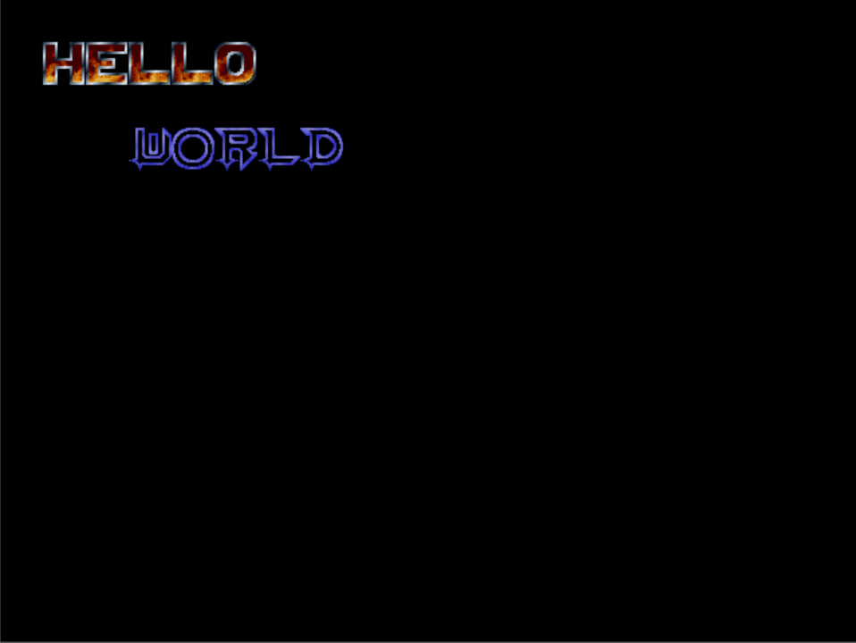

# bitmapper
A small, simple to use "game development library" for use with bitmap fonts

### Compilation
Requires a C compiler that supports gnu extensions, or a C++ compiler

#### Windows:
1. Install msys2 with mingw64 [here](https://www.msys2.org/) and follow their installation steps
2. Open MSYS2 MinGW 64-Bit and paste `pacman -S mingw-w64-x86_64-SDL2` into the terminal, this will install the necessary sdl2 development libraries
3. Add the msys2 bin folder to your PATH 
4. Download the source code from this repo and unzip it
5. Open the unzipped folder in your command line, and run `make`

#### Linux/Other:
You probably already know how to do this
1. Install your distro / Os's version of the sdl2 development libraries
2. Download this repo's source code
3. cd into the source code directory and run `make`

### Running the Example:
1. Download the SDL2 runtime binaries for your OS. Windows and Mac binaries are available [here](https://www.libsdl.org/download-2.0.php)
2. Place the SDL2.dll or SDL2.so (i use windows, i'm just assuming thats what its called) file into the 'test' directory or on the PATH
3. Make a directory inside the 'test' directory, called 'fonts'
4. Download '32X32-FD.png' and '32X32-FG.png' from [here](https://github.com/ianhan/BitmapFonts) and place them in the 'fonts' folder
5. run the file named 'test.exe' or 'test' (depending on your operationg system)
    
If all went well, you should get an output like this:

Press the arrow keys and WASD to move the 2 different text layers, and use left shift and tab to turn on and off tinting of one of them